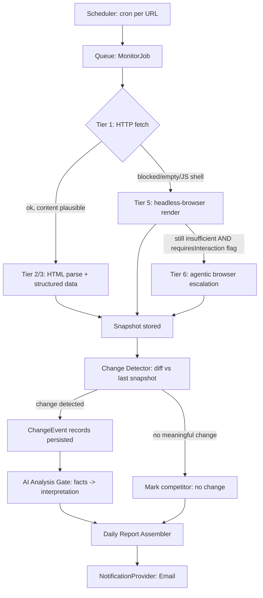

# Competitor Monitor AI — Phase 0: Architecture Analysis

**Status:** Superseded by implementation. This document captures the original planning analysis
before any code was written; Phase 1 (see [PHASE1-REPORT.md](PHASE1-REPORT.md) and
[PHASE1-VALIDATION.md](PHASE1-VALIDATION.md)) implemented and validated the foundation described
here, with a few deliberate simplifications noted inline.

---

## A. Build vs. Buy Analysis

Before writing any code, the extraction layer was evaluated as a build-vs-buy decision across
three approaches:

1. **A general-purpose crawling framework** (queueing, retries, proxy rotation, and a tiered
   HTTP → headless-browser escalation model as a first-class concept). Permissively licensed
   options exist and are a reasonable dependency for a commercial product, but pulling in a full
   crawling framework for what amounts to "fetch a page on a schedule and parse it" was judged to
   add more surface area (its own configuration model, its own storage/queue abstractions
   overlapping with our own database and job queue) than it saves for Phase 1's actual scope.
   **Decision: build a small, purpose-built extractor instead** — a plain HTTP fetch plus HTML
   parsing, both under our own control (see `packages/extraction`). This can be swapped for a
   heavier framework later if the tiered-escalation ladder outgrows a hand-rolled implementation,
   without changing the `Extractor` interface any calling code depends on.

2. **An agentic, LLM-driven browser-automation approach** (an AI agent that drives a real browser
   to click, type, and navigate a page rather than following hard-coded selectors). This is a
   legitimate answer for the hardest class of pages (login walls, heavy anti-bot measures, pages
   that require multi-step interaction), but it is fundamentally non-deterministic and expensive
   per run — the opposite of what a change-detection product needs for its default path (Section
   1 of the product brief: the monitoring system, not an LLM, is the source of truth for whether a
   change occurred). **Decision:** if this tier is ever built, it must be an isolated, optional,
   explicitly opt-in escalation path used only for the small minority of URLs the earlier tiers
   genuinely cannot handle — never the default extraction path, never invoked automatically per
   scan. Not implemented in Phase 1.

3. **A hosted or self-hosted third-party scraping API** that turns arbitrary pages into clean
   markdown/structured JSON. Some well-known projects in this space are released under a strong
   copyleft license (AGPL or similar) for their self-hostable core. Embedding or forking
   AGPL-licensed code into a proprietary, closed-source subscription product would trigger that
   license's network-use disclosure obligation — running a modified AGPL work as a network service
   requires offering the complete corresponding source to users of that service. **Decision:** do
   not use AGPL-licensed source code in this codebase, under any circumstances. A hosted version of
   such a service could, in principle, be evaluated later purely as a paid API vendor (like any
   other SaaS dependency, e.g. an email-sending provider) — that is a separate build-vs-buy call
   for a future phase, evaluated on cost and reliability, not something assumed here.

### Bottom line

Build the extraction and change-detection core ourselves, in TypeScript, under our own license and
control. Reach for a well-maintained, permissively-licensed dependency only for genuinely
undifferentiated infrastructure (an HTTP client, an HTML parser, a job queue client, an ORM) —
never for the product's actual differentiator (the extraction ladder, the deterministic comparison
engine, or the AI-interpretation layer). This is reflected directly in `package.json` across the
monorepo: the extraction package depends only on a standard HTML-parsing library, not a scraping
framework, and there is no agentic browser-automation dependency anywhere in the tree.

---

## B. Architecture Proposal

### B.1 High-level shape

A single Node.js/TypeScript monorepo, split into services that can start as one deployable and
split out later:

```
apps/
  web/            → Next.js dashboard + API routes (customer-facing)
  worker/         → Node.js background worker (BullMQ consumer): fetch → extract → snapshot → diff → AI → notify
  browser-agent/  → (not built in Phase 1) isolated microservice for the agentic-browser escalation tier, if ever needed
packages/
  db/             → Prisma schema + migrations, shared types
  extraction/     → Tiered extractor (HTTP → HTML parsing → structured-data → escalation-decision)
  detection/      → Deterministic diff/change-detection engine (pure functions, framework-free, heavily unit-tested)
  ai/             → AI analysis layer: prompt templates, structured-output schema + validation, provider abstraction
  notifications/  → NotificationProvider abstraction (email now, other channels later)
  shared/         → Zod schemas, plan-limit config, tenant utilities
```

**Why a monorepo, one deployable to start:** this is a pre-revenue product. Splitting into
microservices before there's a single paying customer adds operational cost (multiple deploys,
service discovery, cross-service auth) with no benefit yet. A separate, differently-runtimed
service is only worth the split for the one component that genuinely needs blast-radius isolation
(an eventual agentic-browser escalation tier, if built) — a stuck or expensive job there must never
be able to starve the main worker queue.

### B.2 The monitoring pipeline, concretely

```
Scheduler (cron per competitor/URL, based on plan tier)
  → enqueue MonitorJob { competitorId, urlId, tenantId }
Worker picks up job
  → Extraction Tier Router (packages/extraction)
       Tier 1: plain HTTP fetch — cheapest, try first
       Tier 2: HTML parse of the Tier 1 response, visible-text extraction
       Tier 3: structured data pass (JSON-LD, OpenGraph, schema.org, embedded <script type="application/json">)
       Tier 4: known e-commerce/SaaS platform adapters (best-effort, not a core dependency)
       Tier 5: headless-browser rendering — only if Tier 1 status/content signals JS-rendering is required
       Tier 6: agentic browser escalation — only if Tier 5 fails or the page requires interaction (explicit per-URL opt-in, never automatic)
  → Snapshot writer (packages/db)
       stores raw content hash, structured-data hash, normalized extracted fields, extraction method used, confidence, warnings/errors
  → Change Detector (packages/detection)
       pure, deterministic comparison of current snapshot vs. last successful snapshot for the same URL
       outputs zero or more ChangeEvent records with type/severity/old/new/% delta — computed in code, never by an LLM
  → AI Analysis Gate
       only invoked if at least one ChangeEvent exists (cost control)
       sends structured before/after facts (not raw HTML) to the AI provider
       validates JSON output against a strict schema; on failure/timeout, the ChangeEvent still gets persisted and reported, just without an AI narrative
  → Report assembler (daily cron, separate from per-scan pipeline)
       aggregates the day's ChangeEvents per tenant into the daily digest
  → NotificationProvider.send(report) → Email (Phase 1), other channels later
```

*Phase 1 implemented Tiers 1-3 (`HttpExtractor` and `CheerioExtractor`) and the full
Fetch→Extract→Snapshot→Compare→ChangeEvent chain, validated end-to-end against real infrastructure.
The AI gate, report assembler, and notifications are not built yet — see PHASE1-REPORT.md's
"What's NOT built" list.*

### B.3 Escalation logic (the part that controls cost)

Escalation between tiers is **decided by code, not by an LLM**, based on cheap deterministic
signals:

- Tier 1→2/3 always happens (parsing is free once you have bytes).
- Tier 1/2/3 → Tier 5 (headless browser) triggers when: HTTP body is implausibly small vs.
  historical average for that URL, body contains known SPA-shell markers (a near-empty root
  element, `<noscript>` warnings), or a per-URL flag `requiresJs=true` was set after a previous
  run's low-confidence extraction.
- Tier 5 → Tier 6 (agentic browser) triggers **only** on an explicit per-URL flag
  `requiresInteraction=true`, set manually by the customer/admin or after repeated Tier-5 failures
  on a URL a human has reviewed and approved for the higher-cost tier. Never fully automatic,
  because this is the one tier where a single run can cost real money.
- Every escalation decision and its trigger reason is logged on the snapshot record, so cost and
  reliability can be audited per URL.

### B.4 Data flow diagram



---

## C. Technology Decisions

| Component | Chosen | Alternative considered | Reason | Cost implication | Complexity |
|---|---|---|---|---|---|
| Backend/worker language | **Node.js + TypeScript** | Python (FastAPI) | One language end-to-end for web + API + worker; a mature HTML-parsing ecosystem in Node | Neutral | Low — one language, shared types across the monorepo |
| Frontend/dashboard | **Next.js + Shadcn/ui** | Remix, plain React SPA | Matches modern SaaS dashboard conventions, server components reduce client bundle for data-heavy tables | Neutral | Low-medium |
| Database | **PostgreSQL** | DB2, MongoDB | Relational model fits multi-tenant SaaS with clear FK relationships (org→competitor→url→snapshot→change); JSONB columns handle variable structured-extraction payloads | Low (managed Postgres tiers are inexpensive at this scale) | Low |
| ORM | **Prisma** | Drizzle, raw SQL | Strong TypeScript integration, migrations, good enough performance at this scale | Neutral | Low |
| Job queue | **BullMQ (Redis-backed)** | Cloud queue services, Postgres-based queue | Mature, well-documented, supports retries/backoff/rate-limiting/delayed jobs out of the box | Low (small Redis instance) | Low-medium |
| Extraction | **Purpose-built HTTP fetch + HTML parsing** | A general-purpose crawling framework, a third-party scraping API | See Section A — smaller surface area for Phase 1's actual scope; the `Extractor` interface keeps the door open to a heavier implementation later without touching calling code | Reduces engineering cost for the current scope | Low — a small, fully-owned module |
| Headless browser (future) | Not yet implemented | — | Deferred until a real URL demonstrates the need (Section A) | Compute cost per browser session when added — must be tier-gated (Section B.3) | Medium, when built |
| Agentic browser escalation (future) | Not yet implemented, isolated microservice if built | Building nothing at all and accepting some sites can't be monitored | See Section A | Highest per-call cost in the system if ever added — must stay opt-in per URL, never default | Medium to add, but scoped/optional |
| AI provider | **Claude (Anthropic API)**, provider-abstracted | Provider-agnostic from day 1 | Strong structured-output and instruction-following for the FACT/INTERPRETATION/SPECULATION separation; an abstraction layer keeps swapping providers cheap later | Pay-per-token, gated to run only when a ChangeEvent exists | Low-medium |
| Notifications | **Email via a `NotificationProvider` interface** | Direct SMTP-only, no abstraction | Abstracted from day 1 so other channels can be added without touching the pipeline | Low | Low |
| Auth | **Custom session auth (signed JWT cookie)** | A managed auth provider | Kept the table shape minimal for Phase 1 (no adapter-required schema); revisit if team/SSO features grow the requirements | Low | Low-medium, self-rolled |
| Billing | **Deferred** (subscriptions + usage-based add-ons later) | — | Out of scope until product-market signal exists | — | — |
| Hosting | **Single VPS/managed container platform to start** | Kubernetes from day 1 | At 3-10 customers, Kubernetes is pure overhead | Much lower than a Kubernetes setup | Low |
| Observability | **Structured JSON logs + a metrics table in Postgres for cost/usage tracking** | Full metrics/tracing stack | Answers "which URL failed and why" without enterprise-grade observability on day one | Low | Low |

---

## D. Data Model (as designed; see PHASE1-VALIDATION.md for the schema actually applied)

```
Organization (tenant root)
  id, name, plan (STARTER|PRO|BUSINESS), createdAt

User
  id, organizationId (FK), email, name, role (OWNER|ADMIN|MEMBER), passwordHash, createdAt

Competitor
  id, organizationId (FK), name, website, notes, createdAt, isActive

MonitoredUrl
  id, organizationId (FK), competitorId (FK), url, label, category (PRODUCT_PAGE|PRICING_PAGE|GENERAL),
  scanFrequencyMinutes, requiresJs (bool), requiresInteraction (bool),
  lastSuccessfulScanAt, consecutiveFailureCount, isActive, createdAt

Snapshot
  id, organizationId (FK), monitoredUrlId (FK), monitoringJobId (FK), fetchedAt, httpStatus,
  extractionMethod (HTTP|CHEERIO|PLAYWRIGHT|BROWSER_USE), verificationState (CHANGED|NO_CHANGE|FAILED_TO_VERIFY),
  contentHash, structuredDataHash, normalizedContent (text), confidence (float), warnings (JSON array), errorMessage (nullable)

ExtractedEntity
  id, snapshotId (FK), type (PRICE|PRODUCT|PLAN|PROMOTION|GENERIC), key, label, value, currency, raw

ChangeEvent
  id, organizationId (FK), monitoredUrlId (FK), previousSnapshotId (FK, nullable), currentSnapshotId (FK),
  changeType (PRICE_CHANGE|PRODUCT_ADDED|PRODUCT_REMOVED|PROMOTION_CHANGE|CONTENT_CHANGE),
  severity (LOW|MEDIUM|HIGH), confidence (float), fieldPath, oldValue, newValue, currency,
  percentageChange (nullable float), evidenceExcerpt (text), detectedAt

AiAnalysis
  id, changeEventId (FK, 1:1), status (SUCCESS|FAILED|TIMEOUT|SKIPPED),
  summary, category, businessImpact, competitiveInterpretation, speculation, facts (JSON array),
  recommendedAttention (bool), providerModel, promptTokens, completionTokens, costUsd, createdAt

Report
  id, organizationId (FK), reportDate, generatedAt,
  competitorsChecked, urlsChecked, successfulScans, failedScans,
  highSeverityCount, mediumSeverityCount, lowSeverityCount, noChangeCount

NotificationLog
  id, organizationId (FK), reportId (FK, nullable), channel (EMAIL), recipient, status (SENT|FAILED), sentAt, errorMessage

UsageRecord (per MonitoringJob, written whether it succeeds or fails)
  id, organizationId (FK), monitoringJobId (FK, nullable), extractionMethod, browserEscalated (bool),
  aiCallMade (bool), aiPromptTokens, aiCompletionTokens, fetchSucceeded (bool), processingTimeMs, createdAt
```

Notes:
- Every tenant-scoped table carries `organizationId` directly (denormalized, not just reachable via
  a join), so row-level tenant isolation can be enforced with a single `WHERE` clause everywhere —
  this was implemented exactly as designed and is proven by the automated tenant-isolation suite
  described in PHASE1-VALIDATION.md.
- `UsageRecord` is what future plan-limit enforcement and billing would read from.
- Raw HTML/screenshots are not persisted in Phase 1; only normalized text and structured entities
  are stored. Object storage for raw evidence remains a future addition if needed.

---

## E. Monitoring Architecture — Escalation Detail

```
HTTP fetch (Tier 1)
  │
  ├─ Success + plausible content ──────────────► HTML parse + structured-data pass (Tiers 2-3)
  │
  ├─ Blocked (403/429), empty body, or SPA-shell markers
  │        │
  │        ▼
  │  Headless-browser render (Tier 5, not built in Phase 1): full render, then re-run Tiers 2-4 on rendered DOM
  │        │
  │        ├─ Success ──────────────────────────► proceed as above
  │        │
  │        └─ Still fails AND url.requiresInteraction == true
  │                 │
  │                 ▼
  │           Agentic browser escalation (Tier 6, not built in Phase 1): interactive navigation, explicit opt-in only
  │
  └─ Hard failure at every applicable tier ──────► verificationState = FAILED_TO_VERIFY
                                                     (never reported to the customer as a
                                                      business change — proven in PHASE1-VALIDATION.md)
```

Every tier records: method used, duration, byte size, confidence heuristic, and (for the browser
tiers, once built) approximate cost — this is what usage/cost tracking needs for per-URL
accounting.

---

## F. Implementation Roadmap

1. **Phase 1 — Foundations:** monorepo scaffold, Postgres + Prisma schema, auth + multi-tenant org
   model, HTTP/HTML extraction, deterministic change detection, SSRF protection, real queue
   wiring. **Done and validated against real infrastructure** — see PHASE1-REPORT.md /
   PHASE1-VALIDATION.md.
2. **Phase 2 — Dashboard:** Competitors/Changes/Reports/Settings screens, change-detail evidence
   view.
3. **Phase 3 — Headless-browser extraction (Tier 5):** for URLs the HTTP+HTML tiers can't handle.
4. **Phase 4 — Agentic browser escalation (Tier 6):** isolated microservice, explicit per-URL
   opt-in, hard cost ceilings/timeouts.
5. **Phase 5 — AI analysis layer:** provider abstraction, FACT/INTERPRETATION/SPECULATION
   structured prompt, strict JSON schema validation, prompt-injection isolation, graceful
   degradation when AI is unavailable.
6. **Phase 6 — Scheduler:** replace the manual/CLI trigger with real per-plan cron scheduling.
7. **Phase 7 — Reports + notifications:** daily digest assembler, email delivery.
8. **Phase 8 — Billing + plan limits:** subscription management, usage-based enforcement at every
   mutation point.
9. **Phase 9 — Production hardening:** load testing, cost audit against subscription pricing,
   observability review, pre-launch checklist.

Each phase should ship independently testable/demoable.

---

## G. Top Risks

1. **SSRF via customer-supplied URLs** — mitigated from Phase 1: mandatory URL validation + DNS
   resolution check + redirect re-validation on every fetch, proven against real attack patterns
   including redirect chains (PHASE1-VALIDATION.md Section 7).
2. **Cost blowout from uncontrolled browser-tier escalation** — mitigated by design: escalation
   requires explicit per-URL flags, never automatic.
3. **False positives destroying trust** — a failed fetch must never be reported as "the competitor
   removed everything". Mitigated by a dedicated `FAILED_TO_VERIFY` state, enforced by the data
   model and proven with real failure-mode testing (403/429/timeout/malformed/connection-refused,
   PHASE1-VALIDATION.md Section 6).
4. **AI hallucination or prompt injection from scraped content** — mitigated by strict
   FACT/INTERPRETATION/SPECULATION schema validation and treating page content as data, never
   instructions (not yet built — Phase 5).
5. **Legal/ToS risk of scraping** — some sites' terms of service prohibit automated access.
   Mitigation: respect `robots.txt` by default, rate-limit per domain, access only publicly
   available pages, never bypass authentication or CAPTCHAs.
6. **Tenant data leakage** — a query missing an `organizationId` filter would expose one customer's
   competitive intelligence to another. Mitigated by denormalized `organizationId` on every
   tenant-owned table and an automated isolation test suite, proven against a real database
   (PHASE1-VALIDATION.md Section 3).
7. **Unit economics not holding at scale** — subscription pricing must cover compute, AI tokens,
   and storage per customer. Mitigated by per-job usage tracking from day one.
8. **Site structure volatility breaking extraction silently** — mitigated by confidence scoring on
   every snapshot and a human-reviewable evidence trail.
9. **Vendor/API dependency risk** — a single AI provider or infrastructure vendor is a single point
   of failure. Mitigated by a provider-abstraction layer and explicit graceful degradation when AI
   is unavailable.
10. **Scope creep beyond MVP** — mitigated by strict adherence to the phased roadmap; billing,
    advanced permissions, and the browser-automation tiers are explicitly deferred rather than
    built speculatively.

---

## H. MVP Definition

The smallest version realistically testable with paying (or pilot) customers:

- Auth + single-tenant-per-org signup/login.
- Add 3-10 competitors, each with 1-3 monitored URLs.
- HTTP + HTML/structured-data extraction only; browser-based tiers deferred as a known limitation.
- Deterministic change detection for price changes and content diffs, with the
  MonitoringFailure-vs-real-change distinction present from day one.
- AI analysis on detected changes, with the FACT/INTERPRETATION/SPECULATION structure and
  prompt-injection isolation present from the MVP.
- Daily email report; a minimal Competitors/Changes list view for evidence review.
- Manual scan trigger, with the pipeline stages cleanly separated so a real scheduler can be added
  later without rewriting them.
- SSRF protection and tenant isolation are not optional for MVP — these are cheap to build in from
  the start and catastrophic to retrofit.
- No billing integration required for a pilot; usage tracking exists and is enforced in code even
  before any billing system is wired up.
